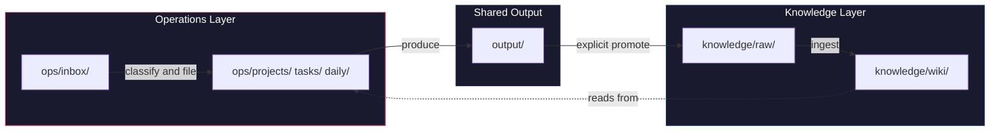

[](LICENSE)

# Dual Brain

**Your second brain is half a brain. This adds the other half.**

> **v2.0** — the first major upgrade: 5 new skills (18 total), a cold evaluation agent for deliverables, guardrail hooks, provenance markers for wiki claims, and a rewritten retrieval canon. Everything was battle-tested in a production vault for three months before landing here. Details in the [CHANGELOG](CHANGELOG.md).

---

## The Problem

I built a second brain. 350 wiki entries. Structured, interlinked, steadily growing. I followed the [Karpathy approach](https://x.com/karpathy/status/1871554790498951368): curated sources in, LLM-maintained wiki out. The collection part worked beautifully.

Then Monday morning hits. You are planning your week, prepping a pitch, drafting an email to a stakeholder. And your wiki just sits there. You *know* you wrote something about this six weeks ago. You *know* there is a framework that fits. But the gap between "I stored this somewhere" and "it shapes my work right now" is wider than you think.

The second brain had long-term memory but no working memory.

## The Idea

Your brain does not have one memory. It has two. **Long-term memory** stores what you know. **Working memory** handles what you are doing right now. They work together: working memory constantly pulls from long-term memory. And occasionally, something from your daily work is important enough to commit to long-term storage.

Dual Brain mirrors this in a single Obsidian vault:

**Knowledge Layer.** Your long-term memory. A curated, interlinked wiki built from quality sources. Persistent, cumulative, ever-improving.

**Operations Layer.** Your working memory. Tasks, projects, daily plans, meeting notes, people, context. High-churn, action-oriented.

The key mechanic: **Operations reads from Knowledge freely and proactively.** When you draft a concept for a client, the system pulls in relevant frameworks, past analyses, and entity context from your wiki. Without you having to remember where you put them.

The reverse direction is deliberately manual. You decide when something from your daily work is good enough to become permanent knowledge. No auto-promotion. No silent bleed between layers.

## Architecture

```
ops/                          # Working memory
  chronicle.md                #   Operational audit trail
  inbox/                      #   Unsorted incoming material
  projects/                   #   Active projects and next actions
  tasks/                      #   Trackable work items
  daily/                      #   Daily plans and reviews
  weekly/                     #   Weekly summaries
  people/                     #   Stakeholders, contacts, follow-ups
  context/                    #   Reference material for current work

knowledge/                    # Long-term memory
  raw/                        #   Curated source documents (read-only)
  wiki/
    sources/                  #   One summary per ingested source
    entities/                 #   People, orgs, products, tools
    concepts/                 #   Ideas, methods, frameworks
    skills/                   #   Executable LLM skill definitions (SOPs)
    synthesis/                #   Cross-source analyses
    glossary.md               #   Alias expansion for retrieval
    index.md                  #   Master catalog
    log.md                    #   Operation log (newest-first)
    overview.md               #   Running synthesis of all knowledge

output/                       # Shared: deliverables, drafts, polished artifacts
archive/                      # Cold storage
```

### How Information Flows



The dotted line is the whole point. Knowledge flows into daily work automatically. The solid lines require your say-so.

## What Makes This Different

**Continuous Routing.** The system does not wait for you to invoke a skill. Every message you send is evaluated: Is this a new task? Does it belong to an existing project? What does the wiki know about this topic? This runs in the background on every interaction, not just when you type a slash command.

**Cross-layer bridge.** A `knowledge:` frontmatter field in any operations file links it to relevant wiki pages. Obsidian backlinks make these connections visible in both directions. When you open a wiki page about "Growth Marketing," you see every project and task that drew from it.

**Knowledge-powered production.** `/produce` drafts memos, pitches, concepts, and analyses by actively pulling in two types of knowledge: methodological (how to write well, how to structure an argument) and specific (what you wrote about this topic before, what your wiki says about the people involved). Your 350 entries finally do something.

**Explicit promotion.** Nothing moves from operations to knowledge automatically. The path is always: `ops/ > output/ > knowledge/raw/ > knowledge/wiki/`. Every step requires your decision. This keeps the wiki clean and the operations layer disposable.

**Cold evaluation instead of self-certification.** Deliverables from `/produce` and `/delegate` are not graded by the model that wrote them. A separate read-only evaluator agent gets only the file path, reads the normative rules at runtime, and judges PASS/REJECT with a findings list. Generator and evaluator never share a context.

**Provenance you can grep.** Ingested wiki pages tag every claim: `[verified]`, `[claim]`, `[unsourced ⚠️]`, `[speculation]`. Six months later you still know which statements stood on evidence and which were the author's opinion. `/knowledge-lint` checks the markers stay intact.

**Guardrails as code, not as prose.** Two small Python hooks enforce the two rules that matter most when an LLM maintains your files: writes into `knowledge/wiki/` require a confirmation once per session, and delete commands always ask first. Both fail open — a broken hook never blocks you.

## Getting Started

**You need:**
- [Obsidian](https://obsidian.md/) (free, any platform)
- [Claude Code](https://docs.anthropic.com/en/docs/claude-code) (requires an Anthropic API key or a Claude Pro/Max subscription)
- [Obsidian Web Clipper](https://obsidian.md/clipper) (free browser extension, for capturing web sources directly into `knowledge/raw/`)

### 1. Clone the repo

```bash
git clone https://github.com/Nocode-Cyclope/dual-brain.git my-vault
cd my-vault
```

This creates a folder called `my-vault` with the full Dual Brain structure inside.

### 2. Open the vault in Obsidian

Open Obsidian. Click **"Open folder as vault"** (bottom left on first launch, or via the vault switcher). Select the `my-vault` folder you just cloned. Obsidian will index the files and you can browse the structure.

### 3. Start Claude Code in the vault directory

Open a terminal, navigate to the same folder, and launch Claude Code:

```bash
cd my-vault
claude
```

Claude Code reads the `CLAUDE.md` in the vault root and loads all 18 skills automatically.

### 4. Run the setup wizard

```
/setup-dual-brain
```

This asks for your name, your preferred language, your work domains, and your personal domains. It scaffolds the folder structure, creates template files, and tailors `CLAUDE.md` to your setup.

### 5. Start working

```
/new meeting with Sarah about the Q3 launch
```
Captures, classifies, and files it as a project, task, or person note.

```
/today
```
Builds your daily plan from due tasks, active projects, and relevant knowledge.

```
/knowledge-ingest
```
Drop a source file into `knowledge/raw/` (or clip a web page there using the Obsidian Web Clipper), then run this to process it into structured, interlinked wiki pages.

```
/produce concept for the Q3 launch strategy
```
Writes a deliverable backed by your wiki. Pulls in relevant frameworks and prior work automatically.

The system builds itself as you use it. Capture into Operations, ingest into Knowledge, and the connections grow naturally.

## Skills

### Knowledge Layer

| Skill | What it does |
|---|---|
| `/knowledge-ingest` | Processes source documents from `knowledge/raw/` into structured, interlinked wiki pages. Discusses key takeaways before writing. |
| `/knowledge-query` | Answers questions from the wiki. Cites sources. Offers to save valuable answers as synthesis pages. |
| `/knowledge-lint` | Finds broken links, orphan pages, contradictions, stale claims, and unprocessed sources. Reports by severity. |

### Operations Layer

| Skill | What it does |
|---|---|
| `/new` | Quick capture. Classifies input as task, project, person, idea, or context. Checks for existing projects before creating new ones. Bridges to wiki entities. |
| `/today` | Generates a daily plan from due tasks, active projects, and a knowledge briefing section with relevant wiki context. |
| `/daily-review` | End-of-day review. Compares plan vs. reality, updates task statuses, logs observations. |
| `/weekly-review` | Weekly summary. Identifies promotion candidates for the knowledge layer. |
| `/produce` | Creates deliverables with active knowledge support. Pulls in methodological frameworks and specific prior work from the wiki. Certified by the cold evaluator agent, not by its author. |
| `/delegate` | Hands off a task to a sub-agent. Includes automatic knowledge discovery before the agent starts, and the cold evaluator on the way back. |
| `/ops-sweep` | Inventory grooming. Triages inbox, task statuses, and `output/` into confirmation-gated proposal lists. Never moves or deletes anything on its own. |
| `/heartbeat` | Weekly read-only health report: inbox backlog, lint distance, overdue tasks, sweep staleness. Reports, changes nothing. |
| `/history` | Shows recent vault activity from chronicle and wiki log. |
| `/farm` | Triggers a context farmer to pull external sources into `ops/inbox/`. |
| `/create-farmer` | Builds or schedules a context farmer for an external source (Slack, RSS, email). |

### Decision Support

| Skill | What it does |
|---|---|
| `/council` | Five isolated sub-agent roles (Skeptic, Philosopher, Visionary, Operator, Outsider) research a weighty question independently, cross-critique anonymously, and a Chair renders the verdict. Not for everyday yes/no questions. |

### System

| Skill | What it does |
|---|---|
| `/setup-dual-brain` | Interactive onboarding. Scaffolds the vault, configures domains, tailors CLAUDE.md. Refuses to scaffold over an established vault. |
| `/second-brain-upgrade` | Meta-skill for structural changes. Enforces the Dual-Brain base principles before any new skill, schema, or architecture change is drafted. |
| `/memory-lint` | Reviews accumulated memory lessons: classify, test effectiveness, and escalate (keep / sharpen / promote to CLAUDE.md / archive). |

## Agents

Three sub-agent definitions ship in `.claude/agents/`:

| Agent | Role |
|---|---|
| `output-evaluator` | Cold evaluation of deliverables. Read-only, receives only a file path, reads the normative rules at runtime, judges PASS/REJECT. The Generator/Evaluator split: no model certifies its own writing. |
| `council-insider` | Council member with wiki read access plus web research. |
| `council-outsider` | Council member with web research only — deliberately blind to your vault, so one voice is never anchored by what you already believe. |

Context farmers created by `/create-farmer` land in the same directory.

## Guardrail Hooks

Two small Python hooks in `.claude/hooks/`, wired via `.claude/settings.json`, enforce the vault's two most important protections deterministically:

- **`wiki_ask_guard.py`** — the first write into `knowledge/wiki/` in a session asks for confirmation ("Do not write casually"); after one approval the session passes silently. `glossary.md` is exempt (declared retrieval infrastructure).
- **`delete_guard.py`** — any delete command (`rm`, `Remove-Item`, `shutil.rmtree`, `unlink`, ...) asks first, per the File Operations Discipline: explicit OK plus a recovery path (`archive/` instead of hard delete).

Both fail open: if a hook errors, the tool call runs normally. Requires Python 3 on PATH. To disable a hook, remove its entry from `.claude/settings.json`.

## Recommended Tools

None of these are required. All of them make the system better as your vault grows.

### CLI Tools

| Tool | What it does | When it matters |
|---|---|---|
| [qmd](https://github.com/tobi/qmd) | Local search engine for markdown files with hybrid BM25/vector search | Once your wiki passes ~100 pages, index scanning gets slow. `qmd` makes `/knowledge-query` fast again. Install: `npm i -g @tobilu/qmd` |
| [summarize](https://github.com/steipete/summarize) | Summarizes links, files, and media from the CLI | Speeds up source preparation before dropping files into `knowledge/raw/`. Install: `npm i -g @steipete/summarize` |
| [agent-browser](https://github.com/vercel-labs/agent-browser) | Browser automation CLI for AI agents | Useful for `/delegate` tasks that involve gathering information from the web. Install: `npm i -g agent-browser` |

### Obsidian Plugins

| Plugin | What it does | Why it matters here |
|---|---|---|
| [Web Clipper](https://obsidian.md/clipper) | Clip web pages directly into your vault | The fastest way to get sources into `knowledge/raw/`. Clip an article, run `/knowledge-ingest`, done. Configure the default save location to `knowledge/raw/`. |
| [Dataview](https://github.com/blacksmithgu/obsidian-dataview) | Query frontmatter across all files | The `type:` field is vault-wide by design. Queries like `TABLE due, status WHERE type = "task" AND status = "pending"` work across both layers. This is the plugin that turns frontmatter from metadata into an interface. |
| [Templater](https://github.com/SilentVoid13/Templater) | Template engine for new files | Pairs well with `/new` for consistent frontmatter when you create files manually in Obsidian. |
| [Calendar](https://github.com/liamcain/obsidian-calendar-plugin) | Calendar view for daily notes | Makes `ops/daily/` navigable. Click a date, see the plan. |

## Standing on Shoulders

This project builds directly on the work of others:

- **Andrej Karpathy** published the [original idea](https://x.com/karpathy/status/1871554790498951368) and the [reference implementation](https://gist.github.com/karpathy/442a6bf555914893e9891c11519de94f) for LLM-maintained knowledge bases. The insight that an LLM can be your librarian, not just your search engine, started everything.
- **Nicholas Spisak** built [second-brain](https://github.com/NicholasSpisak/second-brain): the wiki architecture and knowledge operations (ingest, query, lint). The Knowledge Layer stands on this foundation.
- **Brad** built [second-brain](https://github.com/bradautomates/second-brain): the operations layer and active second brain patterns (capture, classify, daily review). The Operations Layer adapts these ideas.
- **Claude Code** by Anthropic was the development partner for the entire implementation. Every skill, every workflow, every line of `CLAUDE.md` was built in collaboration.

## License

[MIT](LICENSE)

## Contributing

PRs are welcome. If you have found a way to make the two layers talk to each other better, or you have built a skill that fills a gap, open an issue or a PR.

The architecture is intentionally opinionated: two layers, explicit promotion, no auto-mixing. But there is room to improve individual skills, add new farmers, or refine the workflows.
